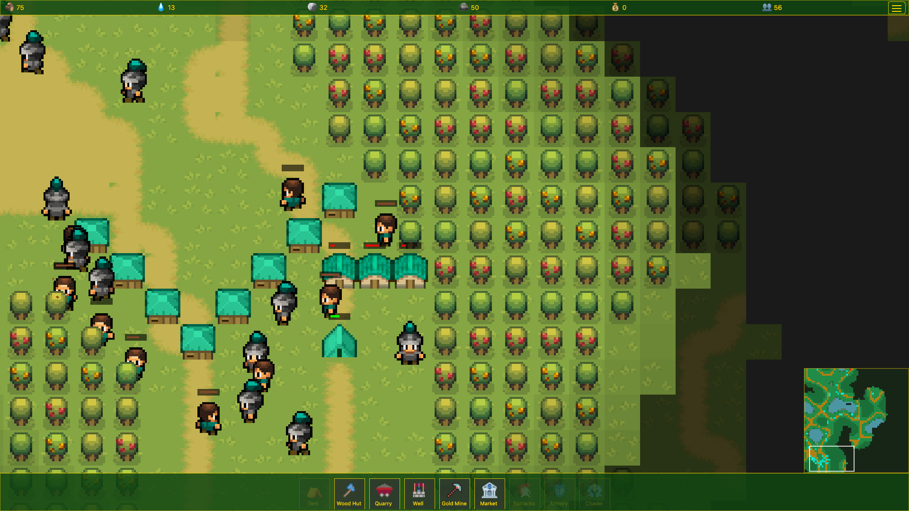
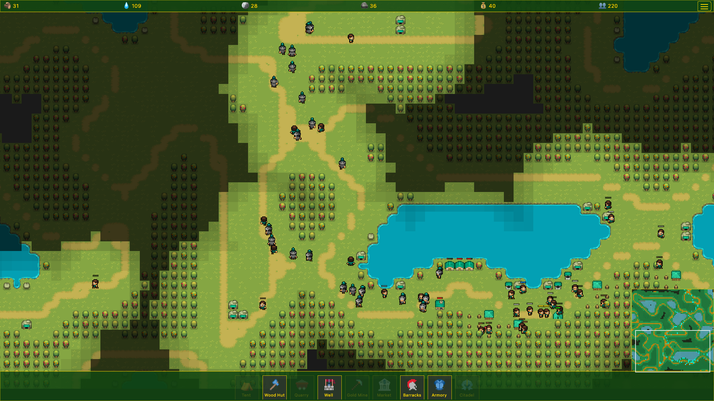
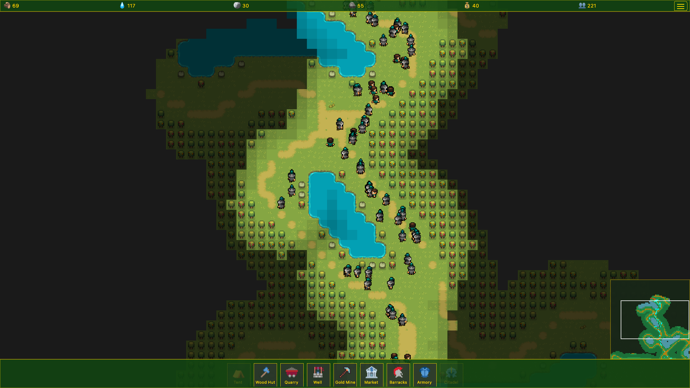

 

#  Pixel Fortress

**Pixel Fortress combines strategic base-building with automated warfare.** Design your fortress, establish resource production, and deploy self-directed units that explore, gather, and battle autonomously. Strategic depth without the micro-management.

➡️ [Play live](https://dorianbayart.github.io/pixel-fortress/play.html) — stable release

🧪 [Try the unstable next version](https://dorianbayart.github.io/pixel-fortress/unstable/play.html) — updated on every commit to `main`

## 🎯 Genre
**Base Building • Automated Strategy • Resource Management • Auto-battler • Pixel Art**

<!-- Marketing Tagline Options:
- "Build smart. Let them fight."
- "Strategy without the stress."
- "Your fortress. Their war."
- "Design. Deploy. Dominate."
-->

## ✨ Features

* **Strategic Base Building:** Choose what and where to build - buildings automatically produce specialized units
* **Automated Warfare:** Units move, explore, gather resources, and battle enemies autonomously
* **Resource Management:** Build gathering buildings (lumberjacks, quarries, wells) to fuel your economy
* **Multiple AI Opponents:** Play against up to 3 AI players with different difficulty levels (easy, normal, hard)
* **Diverse Unit Types:** Deploy workers, soldiers, archers, and mages - each with unique abilities and stats
* **Procedural Maps:** Unlimited randomly generated maps in 3 different sizes, plus many predefined scenarios
* **Dynamic Exploration:** Huge maps with fog of war - your units automatically explore uncharted territory
* **Intelligent Pathfinding:** Units navigate complex terrain autonomously using A* pathfinding
* **Defensive Towers:** Place towers that automatically detect and shoot down approaching enemies
* **Building Specialization:** Upgrade buildings along branching paths to unlock specialized variants tailored to your strategy
* **Game Modes:** Classic, speedier gameplay, fast gathering units, and more variants (planned)
* **Campaign Mode:** Story-driven missions (planned)
* **Privacy-friendly Analytics:** Cookie-free game session tracking via self-hosted [Umami](https://umami.is/) — no consent banner needed

## 🎮 Game Modes

**Single-player (vs AI):** Face off against 1-3 AI opponents across:
- **Classic Mode:** Standard gameplay with balanced pacing
- **Speed Variants:** Faster game speed multipliers for quick matches
- **Difficulty Levels:** Easy, Normal, and Hard AI challenges
- **Map Selection:** Choose from predefined scenarios or procedurally generated maps (small, medium, large)

**Campaign Mode (Planned):** Story-driven missions with unique objectives and challenges.

**Multiplayer (Planned):** Online player-versus-player functionality is planned for a future release.

## 📸 Screenshots

  
  <em>Strategic base building and unit pathfinding gameplay</em>

  
  <em>Huge procedurally generated map exploration with large bases and resource management</em>

  
  <em>Epic battles with numerous units engaging in automated combat</em>

## 💻 Technologies Used

* **HTML/2D Canvas:** Provides the structure and visuals of the game.
* **JavaScript:** Handles game logic, rendering, and player interactions.
* **Pixi.js:** Used for rendering, animation and in-game UI.
* **Web Workers:** To enhance performance, the pathfinding calculations are offloaded to a web worker thread.

## 🕹️ Game Mechanics (Brief Overview)

* **Automated Unit System**
Buildings automatically produce units that operate completely independently. You **never** directly command individual units. Instead, you make strategic decisions about:
  - **What to build:** Economy (resource gatherers) vs military (unit producers)
  - **Where to place buildings:** Proximity to resources, defensive positioning, expansion strategy
  - **Resource allocation:** Balancing wood, stone, water, and gold production

* **Unit Behavior**
Units handle everything autonomously:
  - **Workers:** Automatically gather resources (wood, stone, water, gold) and return to your base
  - **Combat Units:** Explore the map, engage enemies within range, and defend your territory
  - **Pathfinding:** All units intelligently navigate terrain using A* pathfinding
  - **Exploration:** Units automatically reveal fog of war and discover enemy positions

* **Combat**
Combat is fully automated - units attack nearby enemies within range or move to engage threats. Your strategic choices in building composition and placement determine the outcome.

* **Victory Conditions**
Eliminate all enemy players by destroying their buildings and units. The AI opponents use the same automated systems you do.

## 🚀 Getting Started

### ✅ Prerequisites

* A modern web browser (such as Chrome)

### 💾 Installation

1. Clone the repository: `git clone https://github.com/dorianbayart/pixel-fortress.git`
2. Navigate to the project directory: `cd pixel-fortress`
3. Use `nvm install` and `nvm use` to install the required Node version (stored in .nvmrc)
4. Install dependencies with `npm install` if you want to use the Electron version
5. Run the unit tests with `npm run test`command

### ▶️ Running the Game

1. Open `index.html` (landing page) or `play.html` (game) in your web browser, or run `npm run start` to launch the Electron app.
2. Enjoy!

### ⚠️ Troubleshooting

* **Game Doesn't Load:** Ensure you have properly cloned the repository.
* **Performance Issues:** Try closing other browser tabs or applications to free up system resources.
* **Unexpected Behavior:** If you encounter bugs or glitches, please report them on the project's issue tracker. Please remember it is still a work in progress.

## 📦 Releases & Builds

The project utilizes GitHub Actions for continuous integration and release management.

### GitHub Workflow

Upon every push to the `main` branch, a GitHub Actions workflow is triggered. This workflow performs the following steps:
1.  **Build:** The game is built into platform-specific executables for Windows, macOS and Linux.
2.  **Release:** A new GitHub release is created (or an existing one with the same version is updated/overwritten).
3.  **Artifact Upload:** The built executables are uploaded to this release.

### Releases

You can find all official releases and their corresponding build artifacts on the [GitHub Releases page](https://github.com/dorianbayart/pixel-fortress/releases).

### Build Artifacts

For each release, the following platform-specific executables are provided:
*   **Windows:** `.exe` installer/executable
*   **macOS:** `.dmg` installer/disk image - does not work as of now due to missing Apple Developper account
*   **Linux:** `.AppImage` executable

These artifacts allow you to run the game natively on your preferred operating system without needing a web browser.

## 🎯 Roadmap

Here's a look at the planned features and improvements:

1. **Enhanced AI:** Improve the AI opponent's decision-making and strategic capabilities.
2. **Multiplayer Support:** Implement online multiplayer functionality for player-versus-player battles.
3. **Campaign Mode:** Create a single-player campaign with a series of missions and objectives.
4. **New Units and Buildings:** Introduce new unit types and buildings with unique abilities and roles.
5. **Advanced Resource Management:** Expand resource gathering and management systems with new resources and strategies.
6. **Terrain and Environment Effects:** Add more diverse terrain types and environmental elements that impact gameplay.
7. **Improved Graphics and Animations:** Enhance the visual fidelity of the game with better sprites and animations.
8. **Sound Effects and Music:** Integrate sound effects and music to create a more immersive experience.
9. **User Interface Enhancements:** Improve the user interface for better clarity and usability.
   
These are just some of the ideas I have in mind, and I am open to suggestions and feedback.
Stay tuned for updates as I continue to develop and expand Pixel Fortress!

A detailed roadmap can be found here: [plans/ROADMAP.md](plans/ROADMAP.md)

## 📋 Planning & Documentation

The `plans/` directory contains strategic planning documents for major features and development milestones:
- **[ROADMAP.md](plans/ROADMAP.md)**: Development roadmap with planned features and their status
- **[LICENSING_BUSINESS_MODEL.md](plans/LICENSING_BUSINESS_MODEL.md)**: Open source licensing strategy and freemium business model
- **[STEAM_DEPLOYMENT.md](plans/STEAM_DEPLOYMENT.md)**: Comprehensive guide for Steam platform deployment

## 🤖 AI Assistant Guidelines

This project includes `CLAUDE.md` and `GEMINI.md` files with detailed context for AI code assistants. If you are using an AI to help with development, please ensure it has access to these files to understand the project's conventions and architecture.

## 🙌 Credits

* Very useful SVG icons: [Pixel Icon Library](https://github.com/hackernoon/pixel-icon-library)
* Main game assets: [Puny World from Merchant-Shade](https://merchant-shade.itch.io/16x16-puny-world)
* Original game assets: [Mini World from Merchant-Shade](https://merchant-shade.itch.io/16x16-mini-world-sprites)

## 📜 License

This project is licensed under the **GNU General Public License v3.0 or later (GPL-3.0-or-later)**.

This means you are free to:

* **Use** — run the program for any purpose
* **Study** — examine how the program works and modify it
* **Share** — redistribute copies of the original program
* **Improve** — distribute copies of your modified versions to others

Under the following terms:

* **Copyleft** — If you distribute modified versions, you must also license them under GPL v3 and make the source code available
* **Attribution** — You must provide appropriate credit and indicate if changes were made
* **No Additional Restrictions** — You may not impose further restrictions on the recipients' exercise of the rights granted herein
* **Commercial Use Allowed** — You may use this software commercially, including selling it (e.g., on Steam), as long as you comply with the GPL v3 terms

**Full License Text:** See the [LICENSE](LICENSE) file in the repository root.

**Learn More:** [https://www.gnu.org/licenses/gpl-3.0.html](https://www.gnu.org/licenses/gpl-3.0.html)

## #️⃣ Keywords

pixel fortress, base building, automated strategy, auto-battler, resource management, pixel art, 2D strategy, HTML5 game, JavaScript, canvas, web game, browser game, pixijs, open source, achievements, procedural generation, AI opponent, autonomous units, strategic gameplay, casual strategy, idle strategy, automated warfare, exploration, fog of war, pathfinding
