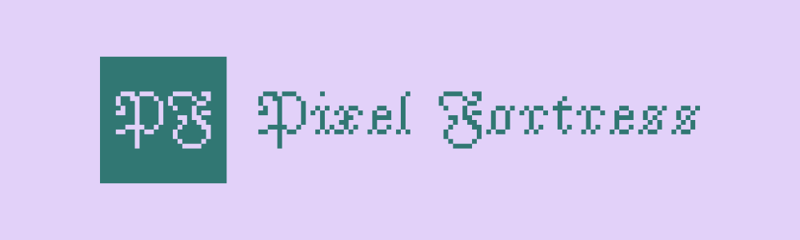
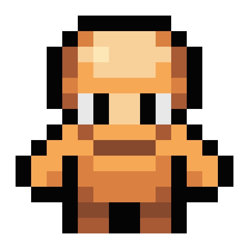

 

#  Pixel Fortress

A 2D pixel-based strategy game that uniquely merges the depth of Tower Defense with the addictive simplicity of Clicker styles.

➡️ [Play live](https://dorianbayart.github.io/pixel-fortress/)

## ✨ Features

* **Strategic Gameplay:** Build up your Fortress to produce units and defend your fortress against enemies.
* **Dynamic Map:** Explore huge randomly generated maps with various terrains and obstacles.
* **Unit Management:** Control multiple units with unique abilities and stats.
* **Zoom:** Use the mouse wheel to zoom in and out for a detailed view of the battlefield.
* **Pathfinding:** Units intelligently navigate the map to reach their destinations.

## 🎮 Game Modes

**Single-player (vs AI):** Currently, the game can be played against an AI opponent. This mode allows you to practice and familiarize yourself with the game mechanics, through campaigns, and predefined or randomly generated maps.

**Multiplayer (vs Player):** Multiplayer functionality will hopefully be added in a future release. This will allow you to play against other players online and compete for dominance on the battlefield.  
Stay tuned for updates! 

## 💻 Technologies Used

* **HTML/2D Canvas:** Provides the structure and visuals of the game.
* **JavaScript:** Handles game logic, rendering, and player interactions.
* **Pixi.js:** Used for rendering, animation and in-game UI.
* **Web Workers:** To enhance performance, the pathfinding calculations are offloaded to a web worker thread.

## 🕹️ Game Mechanics (Brief Overview)

* **Unit Management**  
In Pixel Fortress, you build structures that automatically produce units. These units operate independently, with some dedicated to resource gathering (food, wood, gold, stone, whatever) and others focused on combat against enemy units and structures. You don't directly control individual units; instead, you manage your resource production and building placement to optimize your unit's effectiveness.  
The AI opponent uses the same automated unit management system.

* **Attack**  
Units automatically attack nearby enemies within their range or navigate to engage them.

## 🚀 Getting Started

### ✅ Prerequisites

* A modern web browser (such as Chrome)

### 💾 Installation

1. Clone the repository: `git clone https://github.com/dorianbayart/pixel-fortress.git`
2. Navigate to the project directory: `cd pixel-fortress`
3. Use `nvm install` and `nvm use` to install the required Node version (stored in .nvmrc)
4. Install dependencies with `npm install` if you want to use the Electron version
5. Run the unit tests with `npm run test`command

### ▶️ Running the Game

1. Open the `index.html` file in your web browser, or run `npm run start` to launch the Electron app.
2. Enjoy!

### ⚠️ Troubleshooting

* **Game Doesn't Load:** Ensure you have properly cloned the repository.
* **Performance Issues:** Try closing other browser tabs or applications to free up system resources.
* **Unexpected Behavior:** If you encounter bugs or glitches, please report them on the project's issue tracker. Please remember it is still a work in progress.

## 📦 Releases & Builds

The project utilizes GitHub Actions for continuous integration and release management.

### GitHub Workflow

Upon every push to the `main` branch, a GitHub Actions workflow is triggered. This workflow performs the following steps:
1.  **Build:** The game is built into platform-specific executables for Windows, macOS and Linux.
2.  **Release:** A new GitHub release is created (or an existing one with the same version is updated/overwritten).
3.  **Artifact Upload:** The built executables are uploaded to this release.

### Releases

You can find all official releases and their corresponding build artifacts on the [GitHub Releases page](https://github.com/dorianbayart/pixel-fortress/releases).

### Build Artifacts

For each release, the following platform-specific executables are provided:
*   **Windows:** `.exe` installer/executable
*   **macOS:** `.dmg` installer/disk image - does not work as of now due to missing Apple Developper account
*   **Linux:** `.AppImage` executable

These artifacts allow you to run the game natively on your preferred operating system without needing a web browser.

## 🎯 Roadmap

Here's a look at the planned features and improvements:

1. **Enhanced AI:** Improve the AI opponent's decision-making and strategic capabilities.
2. **Multiplayer Support:** Implement online multiplayer functionality for player-versus-player battles.
3. **Campaign Mode:** Create a single-player campaign with a series of missions and objectives.
4. **New Units and Buildings:** Introduce new unit types and buildings with unique abilities and roles.
5. **Advanced Resource Management:** Expand resource gathering and management systems with new resources and strategies.
6. **Terrain and Environment Effects:** Add more diverse terrain types and environmental elements that impact gameplay.
7. **Improved Graphics and Animations:** Enhance the visual fidelity of the game with better sprites and animations.
8. **Sound Effects and Music:** Integrate sound effects and music to create a more immersive experience.
9. **User Interface Enhancements:** Improve the user interface for better clarity and usability.
   
These are just some of the ideas I have in mind, and I am open to suggestions and feedback.
Stay tuned for updates as I continue to develop and expand Pixel Fortress!

A detailed roadmap can be found here: [plans/ROADMAP.md](plans/ROADMAP.md)

## 📋 Planning & Documentation

The `plans/` directory contains strategic planning documents for major features and development milestones:
- **[ROADMAP.md](plans/ROADMAP.md)**: Development roadmap with planned features and their status
- **[LICENSING_BUSINESS_MODEL.md](plans/LICENSING_BUSINESS_MODEL.md)**: Open source licensing strategy and freemium business model
- **[STEAM_DEPLOYMENT.md](plans/STEAM_DEPLOYMENT.md)**: Comprehensive guide for Steam platform deployment

## 🤖 AI Assistant Guidelines

This project includes `CLAUDE.md` and `GEMINI.md` files with detailed context for AI code assistants. If you are using an AI to help with development, please ensure it has access to these files to understand the project's conventions and architecture.

## 🙌 Credits

* Very useful SVG icons: [Pixel Icon Library](https://github.com/hackernoon/pixel-icon-library)
* Main game assets: [Puny World from Merchant-Shade](https://merchant-shade.itch.io/16x16-puny-world)
* Original game assets: [Mini World from Merchant-Shade](https://merchant-shade.itch.io/16x16-mini-world-sprites)

## 📜 License

This project is licensed under the **GNU General Public License v3.0 or later (GPL-3.0-or-later)**.

This means you are free to:

* **Use** — run the program for any purpose
* **Study** — examine how the program works and modify it
* **Share** — redistribute copies of the original program
* **Improve** — distribute copies of your modified versions to others

Under the following terms:

* **Copyleft** — If you distribute modified versions, you must also license them under GPL v3 and make the source code available
* **Attribution** — You must provide appropriate credit and indicate if changes were made
* **No Additional Restrictions** — You may not impose further restrictions on the recipients' exercise of the rights granted herein
* **Commercial Use Allowed** — You may use this software commercially, including selling it (e.g., on Steam), as long as you comply with the GPL v3 terms

**Full License Text:** See the [LICENSE](LICENSE) file in the repository root.

**Learn More:** [https://www.gnu.org/licenses/gpl-3.0.html](https://www.gnu.org/licenses/gpl-3.0.html)

## #️⃣ Keywords

pixel, fortress, game, strategy, tower defense, TD, clicker, pixel art, 2D, HTML5, JavaScript, canvas, web, browser, pixijs, open source, dungeon, monsters, waves, upgrades, skills, achievements, resource management, base building, survival
